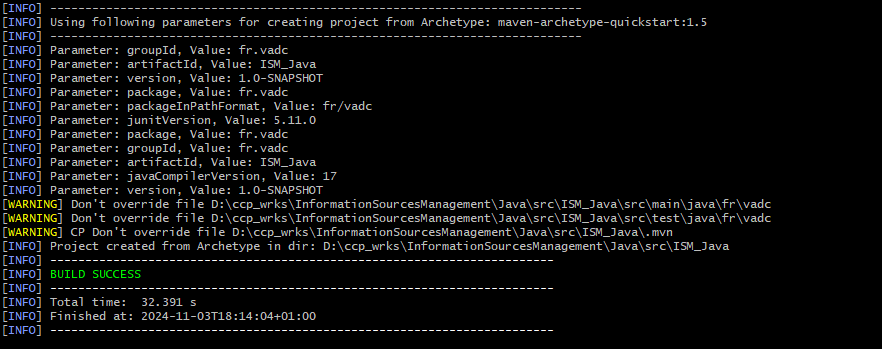
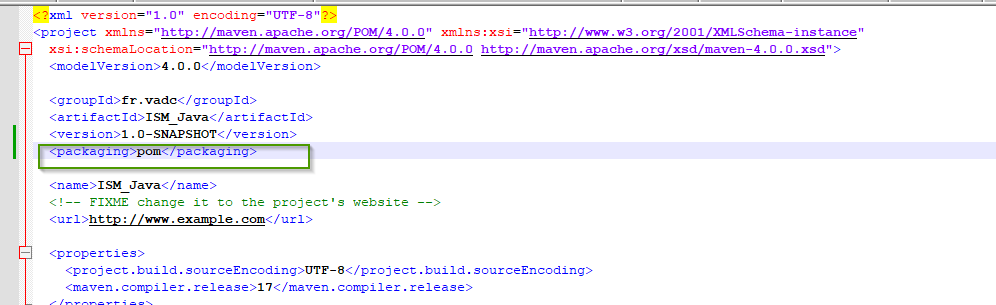
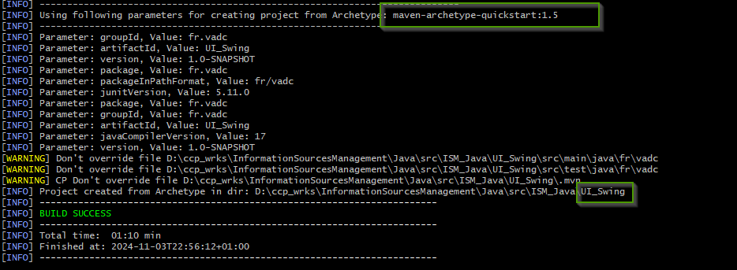
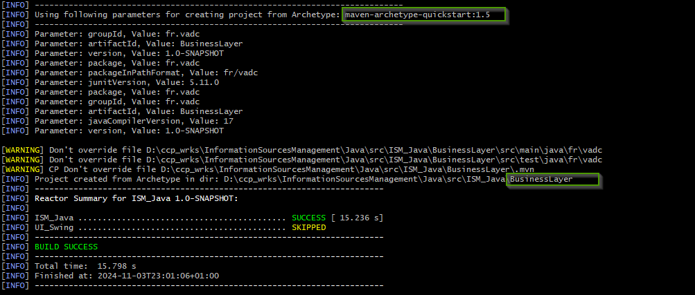
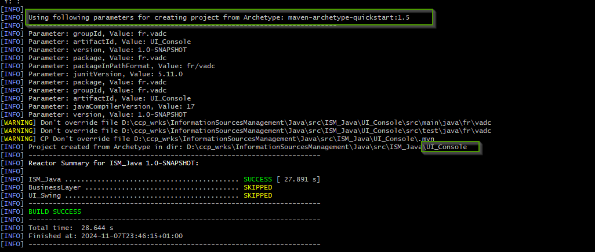

= Information Sources Management - Java version
Doc Writer <christian.popescu@outlook.com>
v 1.0, 2024-11-03
:sectnums:
:toc:
:toclevels: 5
:pdf-page-size: A3

== Introduction

A first version of the tool has been created.

New version maven multimodule :

* User interface

* Business logic

== Mutltimodule maven 

. Create parent module
+
[source, bash]
----
mvn archetype:generate -DgroupId=fr.vadc -DartifactId=ISM_Java
----
+

. In the parent pom file add the packaging as pom.
+

. Go to parent folder  (cd ISM_Java)

. Create UI subproject
+
[source, bash]
----
mvn archetype:generate -DgroupId=fr.vadc -DartifactId=UI_Swing
----
+

. Create Business Layer
+
[source, bash]
----
mvn archetype:generate -DgroupId=fr.vadc -DartifactId=BusinessLayer
----
+

. Create UI as Console application
+
[source, bash]
----
mvn archetype:generate -DgroupId=fr.vadc -DartifactId=UI_Console
----
+

